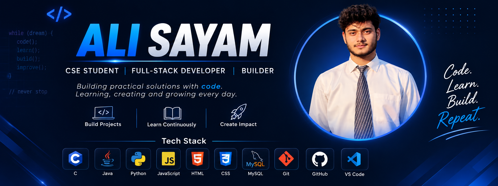

  

# 👋 Hi, I'm Ali Sayam

🎓 Computer Science Engineering Student  
💻 Developer | 🚀 Project Builder

I enjoy building practical projects, learning new technologies, and improving my problem-solving skills through hands-on development.

## 🚀 Current Focus

- 🧠 Data Structures & Algorithms
- ☕ Java & Object-Oriented Programming
- 🌐 Web Development
- 🛠️ Building practical projects
- 🔧 Improving my Git & GitHub workflow

## 🚀 Featured Projects

### 🔹 ClearMate
A project focused on making it easier to identify and resolve common errors.

🔗 [View ClearMate](https://github.com/alisayam-786/ClearMate)

### 🔹 Wayfinder
A campus navigation project designed to help students find important locations around campus.

### 🔹 Light Tracking Robot
An Arduino-based IoT project that follows a light source.

## 📚 Currently Learning

- Data Structures & Algorithms
- Java
- Web Development
- Software Development Practices

## 🤝 Connect With Me

- 💼 [LinkedIn](https://www.linkedin.com/in/ali-sayam/)
- 💻 [GitHub](https://github.com/alisayam-786)
